# 🚆 Ticketron – Railway Ticket Management System

Ticketron is a web-based Railway Ticket Management System developed using **PHP** and **MySQL**.  
The system allows users to securely register, log in, search for trains, view schedules, and book tickets online.  
An admin panel is included to manage trains, schedules, stations, coaches, and ticket pricing efficiently.

This project demonstrates practical implementation of **backend development, database design, authentication, and CRUD operations**.

---

## 📌 Features

### 👤 User Features
- User registration and login system
- Secure session-based authentication
- Train search by:
  - Source station
  - Destination station
  - Travel date
- View train schedules and coach types
- Ticket booking system
- Seat availability tracking
- Booking history (optional/future)

### 🛠️ Admin Features
- Admin authentication
- Manage trains (Add / Update / Delete)
- Manage stations
- Manage train schedules
- Manage coaches and coach types
- Set ticket prices
- Monitor bookings

---

## 🧰 Tech Stack

| Technology | Usage |
|----------|------|
| PHP | Server-side logic |
| MySQL | Database management |
| HTML | Structure |
| CSS | Styling |
| JavaScript | Client-side interactions |
| phpMyAdmin | Database management |
| XAMPP | Local server environment |

---

## 🗂️ Project Structure

Ticketron/
│
├── pages/
│ ├── login.php
│ ├── register.php
│ ├── dashboard.php
│ ├── search_train.php
│ └── book_ticket.php
│
├── process/
│ ├── login_process.php
│ ├── register_process.php
│ ├── booking_process.php
│ └── logout.php
│
├── admin/
│ ├── admin_login.php
│ ├── manage_trains.php
│ ├── manage_stations.php
│ ├── manage_schedules.php
│ └── manage_coaches.php
│
├── config.php
├── db.php
└── README.md


---

## 🗃️ Database Design

### Main Tables
- `users` – stores passenger account details
- `admins` – admin authentication
- `stations` – railway stations
- `trains` – train information
- `schedules` – train routes and timing
- `coaches` – coach types and seat count
- `tickets` – booking records

### Example: `users` Table
| Column | Type |
|------|-----|
| id | INT (PK) |
| name | VARCHAR |
| email | VARCHAR |
| password | VARCHAR |
| created_at | TIMESTAMP |

---

## ⚙️ Installation & Setup

1. Clone the repository
```bash

git clone https://github.com/your-username/ticketron.git


Move the project to XAMPP htdocs

C:\xampp\htdocs\ticketron


Start Apache and MySQL from XAMPP Control Panel

Import the database

Open phpMyAdmin

Create a database named tickettron

Import the provided .sql file

Configure database connection in db.php

$conn = mysqli_connect("localhost", "root", "", "tickettron");


Run the project

http://localhost/ticketron/

🔐 Authentication & Security

Password hashing

Session-based authentication

Protected routes for logged-in users

Admin-only access control

🚀 Future Improvements

Online payment gateway integration

QR code based e-tickets

Email/SMS ticket confirmation

Seat selection UI

Mobile app integration

Role-based access control

📚 Learning Outcomes

PHP & MySQL integration

Relational database design

Secure authentication handling

Real-world CRUD operations

MVC-like folder organization


## 📸 Screenshots

### 🔐 Authentication
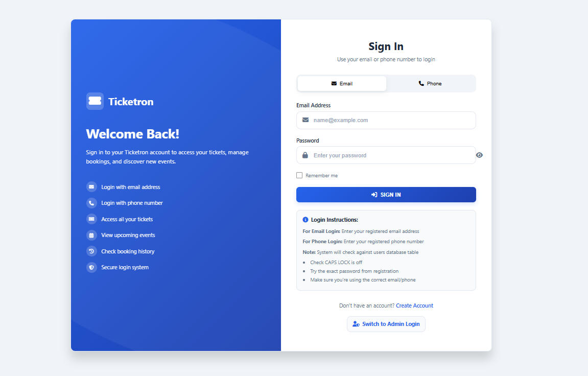

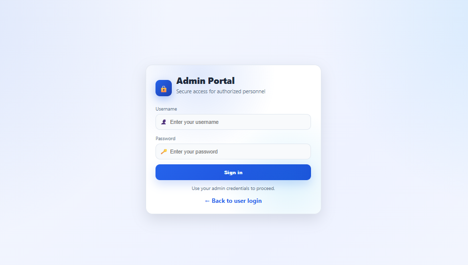

---

### 👤 User Dashboard & Features
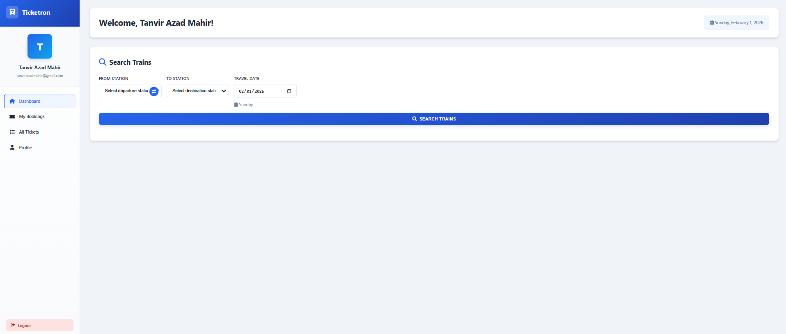
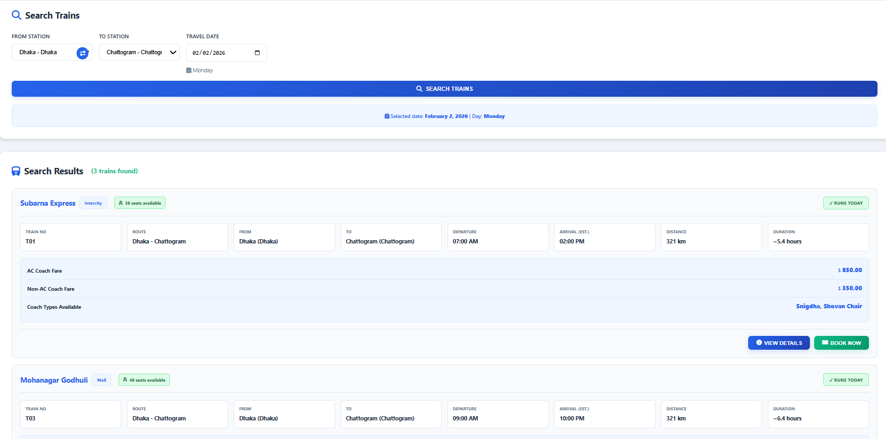
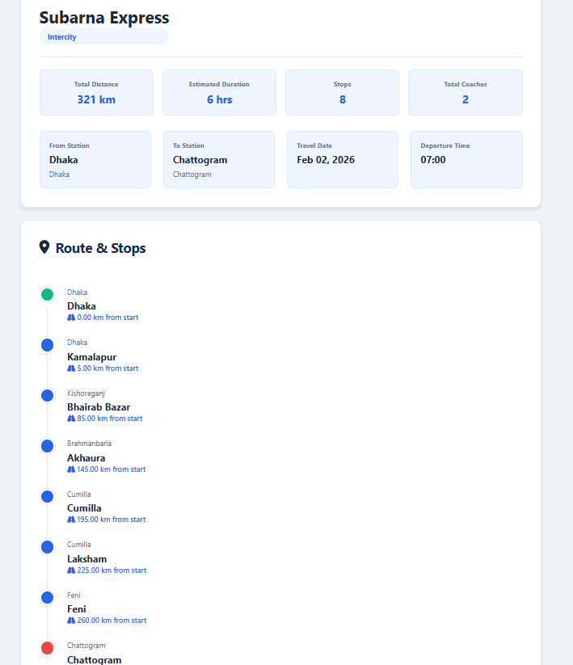
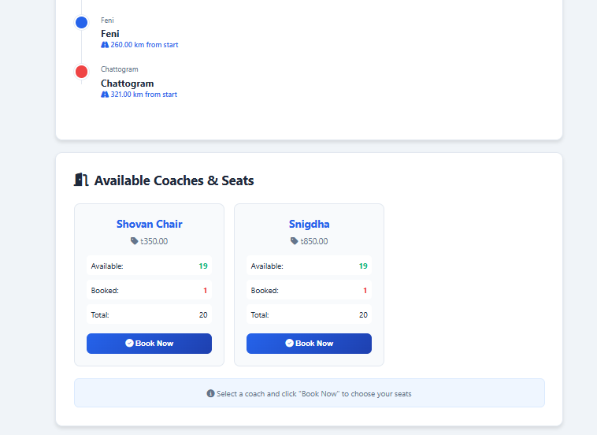

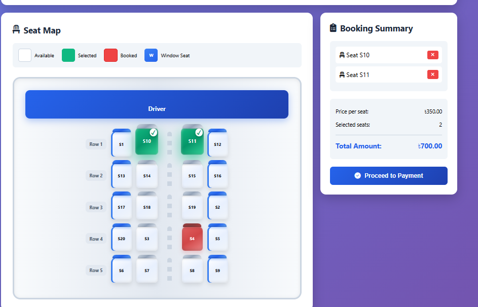
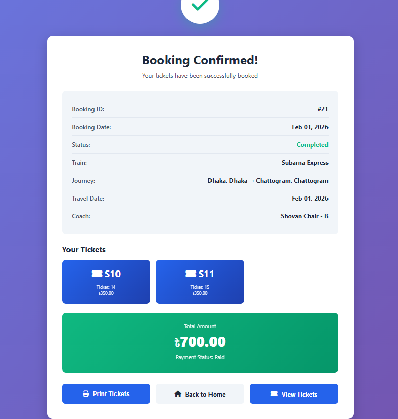

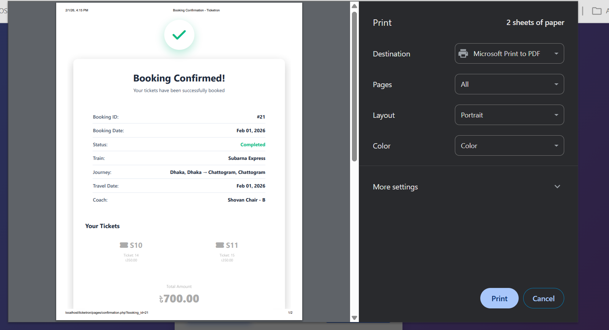

---

### 💸 Refund System
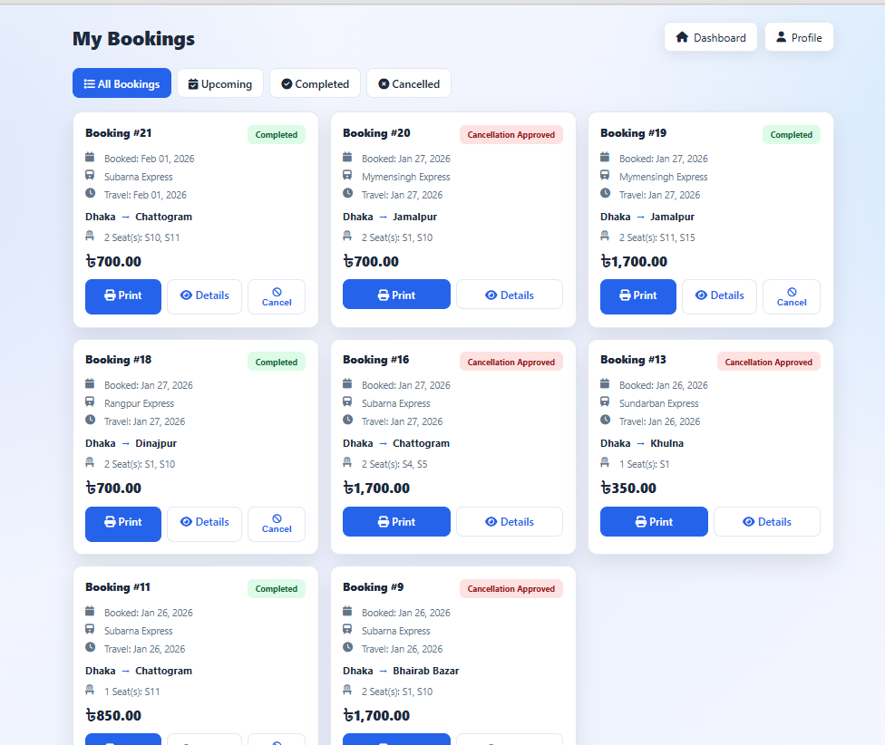
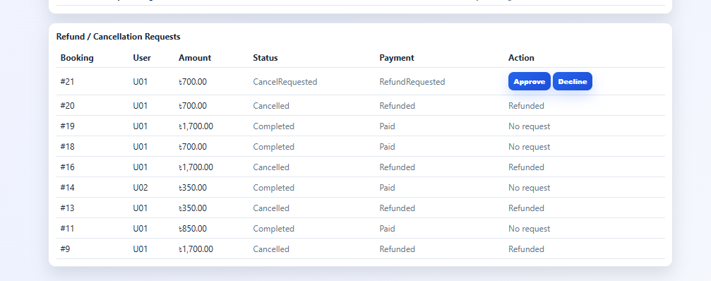
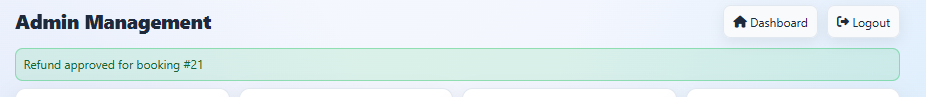

---

### 🛠️ Admin Panel
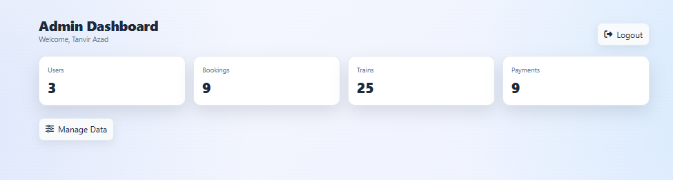
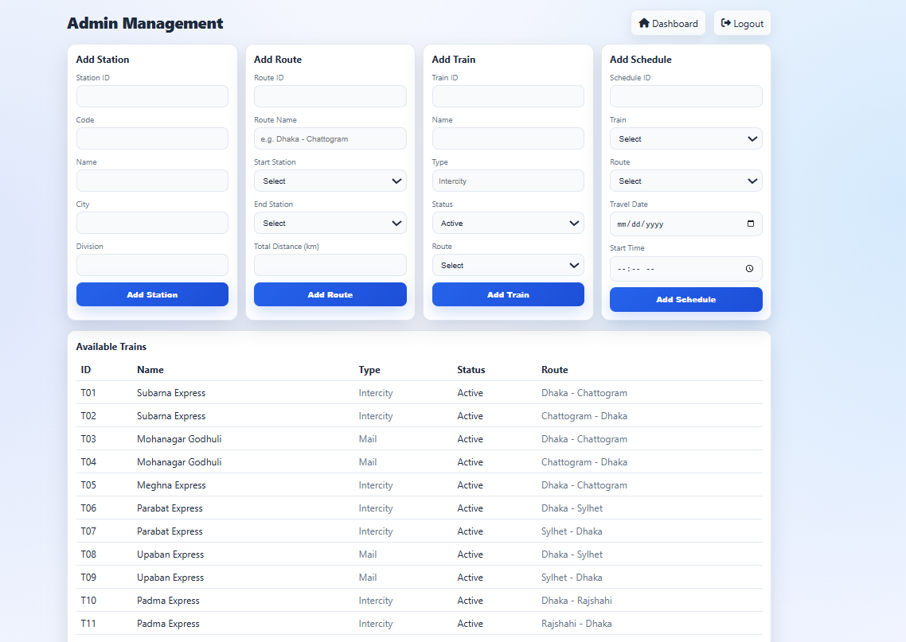

---

### 🗄️ Database Design
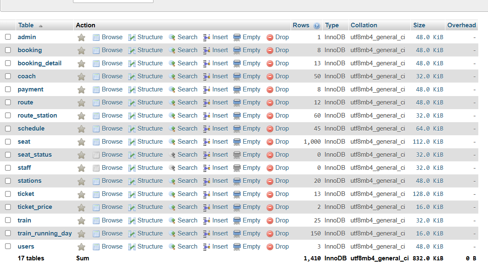
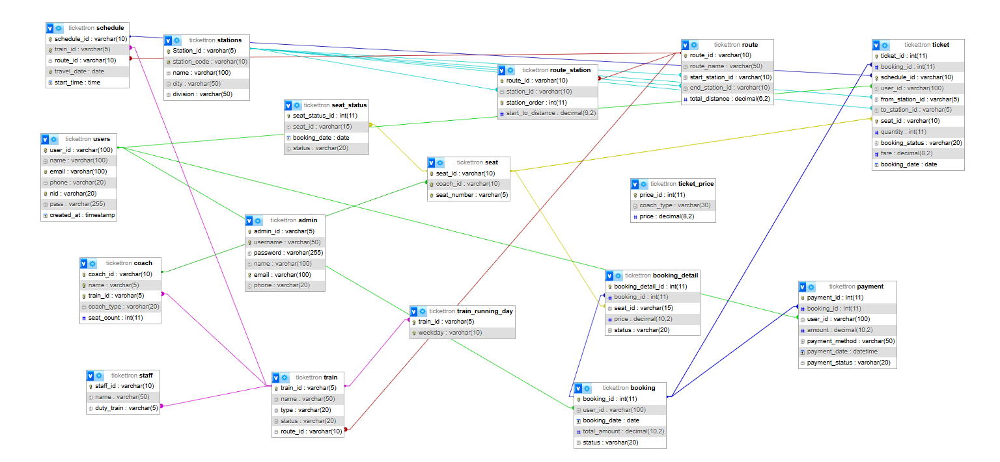


👨‍💻 Author

Tanvir Azad (Mahir)
CSE Student
United International University (UIU)

📜 License

This project is developed for DBMS lab. academic purposes.
Feel free to modify and improve for learning and personal use.


